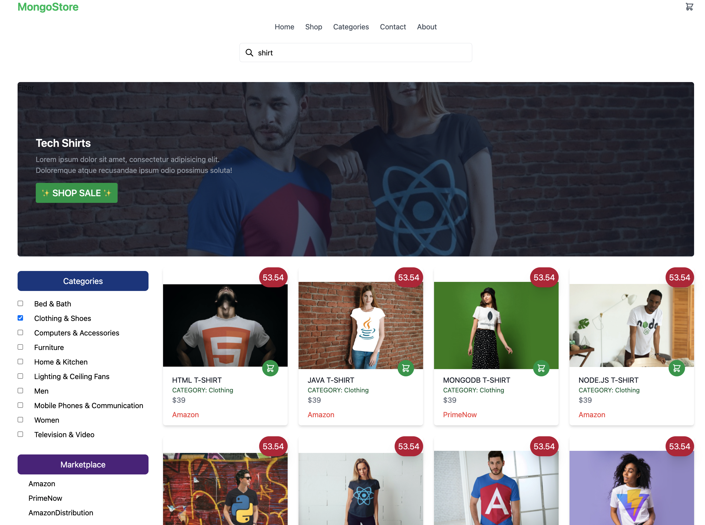

## MongoStore Sample Application

<h3>MongoStore Hackathon</h3>

Hello! 👋 This e-commerce application allows you to search lightning fast through a wide variety of data types through a dataset of Amazon products.

 

 

MongoStore implements many Atlas Search features from autocomplete to custom function scoring. Using the $search operator in a MongoDB aggregation pipeline, we can build fine-grained searches across text, numerics, and geospatial data.

**No additional servers or software needed. No need to keep data in sync. Everything is done in MongoDB Atlas.**

Current features implemented in this e-commerce application include:

-   **authentication and authorization**
-   fuzzy matching
-   highlighting
-   autocomplete
-   relevance-based scoring
-   custom function scoring

Future Atlas Search features to implement can include:

-   [ ] range queries
-   [ ] facets
-   [ ] synonyms

<h2 align="center"><a href="https://mongostoreapp-dnerj.mongodbstitch.com">https://mongostoreapp-dnerj.mongodbstitch.com</a></h2>

This application was created using:

-   React
-   Tailwind CSS
-   MongoDB Realm for backend HTTPs endpoints and webhooks
-   A sample dataset of Amazon products

<h3>API Points of Integration</h3>
This application is hosted entirely on Realm and calls 2 API endpoints:
 
 * getProductsEndpoint in the Home.js page on line 24
 * Suggestions_AC_Endpoint, used for autocompleted product names, in the Header.js component on line 17.

<h3>Prerequisites</h3>

-   A MongoDB Atlas account. Get one for free <a href="https://www.mongodb.com/cloud/atlas">here.</a>
-   A recent version of Node.js and npm.
-   Amazon product sample dataset
-   (Recommended) <a href="https://www.mongodb.com/try/download/compass">MongoDB Compass - GUI</a>

<h3>Instructions</h3>

In the project directory, you can run:

#### `npm install`

#### `npm start`

Runs the app in the development mode.\
Open [http://localhost:3000](http://localhost:3000) to view it in your browser.

## Authentication and Authorization

Steps to reproduce the funcationality with Atlas App Services:

### Activate email password authentication provider

### Activate custom user data

### Define the interceptor function condition

### Create custom data interceptor function

### Verify custom user data in the collection

### Use Application Authentication for Functions modifying the collection data

### Setup Rules for Functions modifying the collection data

## GraphQL and MongoDB Atlas Search

Trigger Search queries with GraphQL:

### Create a custom GraphQL resolver

### Setup input and return types for GraphQL

### Create a custom function for the GraphQL resolver

